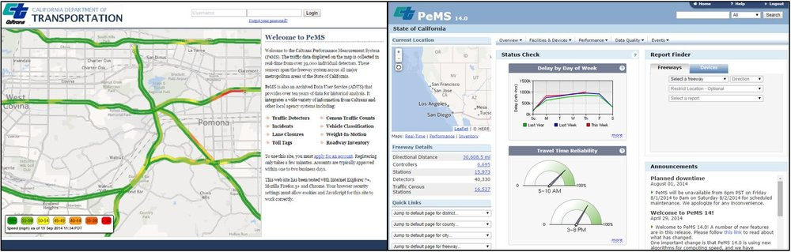

# CalTrans PEMS
This package provides tools to help pull data from the [CalTrans PeMS](http://pems.dot.ca.gov/) database 
programmatically. The code in this repository took advantage of learnings from [get-pems](https://github.com/brianhigh/get-pems) and 
[scraper.py](https://github.com/mas-dse-c6sander/DSE_Cohort2_Traffic_Capstone/tree/master/cohort1/traffic/src)
where similar functionality was implemented. 

 

## License
[MIT](LICENSE.txt)